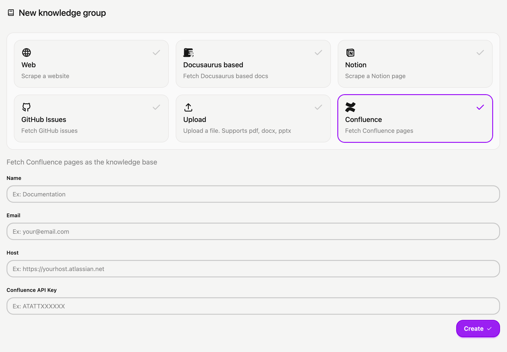
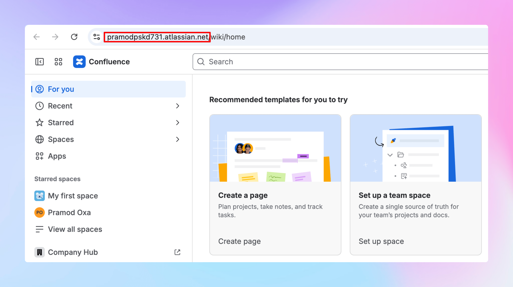

# Confluence pages

Confluence is the most popular place where teams build their internal documentation related to multiple internal processes, SOPs, policies, and more. CrawlChat provides an easy integration using which you can connect your Confluence Pages as knowledge source for the chatbot.

## API Key

You need to create an API Key from the **Confluence** dashboard to make it work. Follow the steps to make one

1. Go to [API Tokens](https://id.atlassian.com/manage-profile/security/api-tokens) page
2. Click on **Create API token**
3. Give it a name to identify, example *CrawlChat Integration*
4. Give an expiration date, better to give it atleast **6 months**
5. Copy the generated API token
6. Also, go to your Conflence home page and copy the host URL as shown below. It generally looks like *https://yourhost.atlassian.net*

## Create group

Go to [New Group](/knowledge/group) page to create import your **Confluence** pages to CrawlChat knowledge base. Select Confluence type and fill the form, you will have to provide your **email**, **host** copied above, and the **API Token** generated in above steps.

Once you create the group, you can also select the pages to skip if you want. Additionally, you can turn on the **auto update** feature for the group by selected the update frequency.

